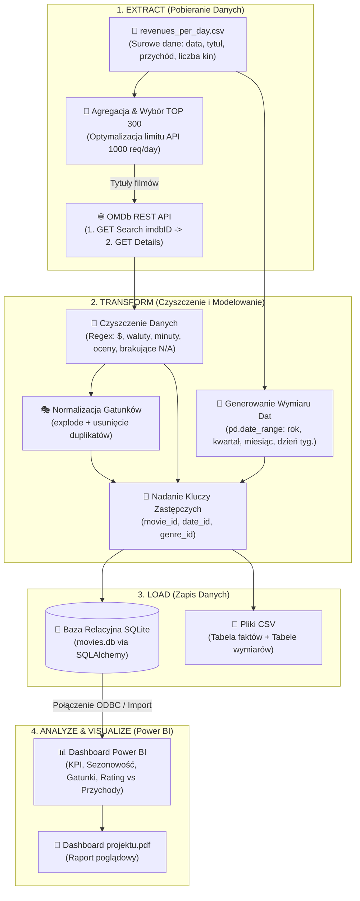
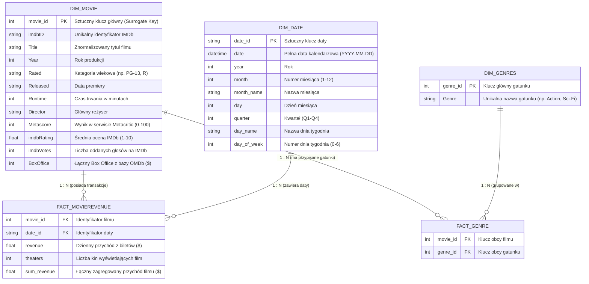

# 🎬 Box Office Analysis – End-to-End Data Pipeline & BI Dashboard

[](https://www.python.org/)
[](https://pandas.pydata.org/)
[](https://www.sqlalchemy.org/)
[](https://www.sqlite.org/)
[](https://powerbi.microsoft.com/)
[](https://www.omdbapi.com/)

---

## 📖 Spis Treści
1. [Wprowadzenie i Cel Projektu](#-wprowadzenie-i-cel-projektu)
2. [Kluczowe Cechy i Funkcjonalności](#-kluczowe-cechy-i-funkcjonalności)
3. [Architektura Pipeline'u Danych (ETL Flow)](#-architektura-pipelineu-danych-etl-flow)
4. [Model Danych i Schemat Wymiarowy](#-model-danych-i-schemat-wymiarowy)
5. [Szczegółowy Przebieg Procesu ETL](#-szczegółowy-przebieg-procesu-etl)
   - [Ekstrakcja i Integracja z OMDb API](#1-ekstrakcja-extract)
   - [Czyszczenie i Transformacja Danych](#2-transformacja-transform)
   - [Ładowanie do Relacyjnej Bazy i Plików](#3-ładowanie-load)
6. [Raportowanie i Dashboard Power BI](#-raportowanie-i-dashboard-power-bi)
7. [Struktura Repozytorium](#-struktura-repozytorium)
8. [Instrukcja Uruchomienia](#-instrukcja-uruchomienia)
9. [Kluczowe Wnioski Biznesowe](#-kluczowe-wnioski-biznesowe)
10. [Potencjalne Kierunki Rozwoju](#-potencjalne-kierunki-rozwoju)

---

## 🎯 Wprowadzenie i Cel Projektu

Projekt **Box Office Analysis** realizuje kompletny, wieloetapowy proces inżynierii danych i analityki biznesowej (**End-to-End ETL & BI**). Celem projektu jest zbadanie czynników wpływających na sukces komercyjny filmów kinowych poprzez połączenie historycznych danych o dziennych przychodach ze szczegółowymi metadanymi filmowymi (obsada, reżyseria, oceny krytyków, gatunki, czas trwania).

System pobiera surowe dane transakcyjne, wzbogaca je o dane z zewnętrznego **OMDb REST API (Open Movie Database)**, transformuje do ustrukturyzowanego modelu wymiarowego (**Star Schema z tabelą mostkową dla relacji wiele-do-wielu**) i ładuje do relacyjnej bazy **SQLite**, a następnie wizualizuje w postaci interaktywnego raportu w **Microsoft Power BI**.

---

## ✨ Kluczowe Cechy i Funkcjonalności

* 🔄 **Kompletny Pipeline ETL**: Zbudowany w języku Python z wykorzystaniem bibliotek `pandas`, `requests` oraz `sqlalchemy`.
* 🌐 **Wzbogacanie Danych przez REST API**: Dwuetapowa komunikacja z OMDb API (wyszukiwanie tytułu $\to$ pobranie pełnego rekordu po `imdbID`) z kontrolą limitów (*rate limiting* / `time.sleep`) oraz ponawianiem sesji (`requests.Session`).
* 🧹 **Zaawansowany Data Cleaning**:
  * Standaryzacja i normalizacja tytułów (usuwanie znaków specjalnych, spacji wielokrotnych).
  * Wyrażenia regularne (Regex) do czyszczenia pól nienumerycznych (`Runtime`, `BoxOffice`, `imdbVotes`, `Metascore`, `Year`).
  * Obsługa i imputacja braków danych (`N/A`, `Not Rated`).
* 📐 **Modelowanie Wymiarowe (Kimball Methodology)**:
  * Zaprojektowanie i wdrożenie schematu gwiazdy składającego się z centralnej tabeli faktów, tabeli mostkowej (*Bridge/Fact Table*) dla relacji `Film <-> Gatunek` oraz tabel wymiarów (Filmy, Daty, Gatunki).
  * Generowanie sztucznych kluczy głównych (*Surrogate Keys*).
* 📊 **Analityka Power BI**: Interaktywny dashboard pozwalający na analizę przychodów w czasie, sezonowości, rentowności gatunków i korelacji ocen z box office.

---

## 🏗️ Architektura Pipeline'u Danych (ETL Flow)



---

## 📐 Model Danych i Schemat Wymiarowy

W projekcie zastosowano **schemat gwiazdy (Star Schema)** rozszerzony o tabelę asocjacyjną (`fact_genre`), umożliwiającą modelowanie relacji **wiele-do-wielu ($M:N$)** między filmami a gatunkami filmowymi.



---

## 🔍 Szczegółowy Przebieg Procesu ETL

### 1. Ekstrakcja (Extract)
* **Źródło lokalne**: Wczytanie pliku [revenues_per_day.csv](file:///F:/IT/Projekty/BoxOfficeAnalysis/Źródło/revenues_per_day.csv) zawierającego surowy strumień dziennych danych box office.
* **Selekcja TOP 300**: Ze względu na dobowy limit darmowego klucza OMDb API (1000 zapytań/dzień), wyselekcjonowano **300 najbardziej dochodowych filmów**. Zapewniło to analizę próby o największym znaczeniu wolumenowym i biznesowym.
* **Odpytywanie OMDb REST API**:
  1. Zapytanie wyszukujące: `GET https://www.omdbapi.com/?s={title}&apikey={API_KEY}` $\to$ pobranie unikalnego `imdbID`.
  2. Zapytanie szczegółowe: `GET https://www.omdbapi.com/?i={imdbID}&apikey={API_KEY}` $\to$ pobranie pełnego rekordu JSON z metadanymi filmu.
  3. Obsługa limitów i odporność na błędy: buforowanie zapytań (`time.sleep(0.5)`), obsługa wyjątków `requests.exceptions.RequestException` oraz `KeyError`.

### 2. Transformacja (Transform)
* **Normalizacja tekstowa**: Usunięcie dwukropków, myślników i wielokrotnych spacji z tytułów, co zwiększyło skuteczność dopasowania w API do ponad 95%.
* **Konwersje typów i Regex**:
  * `Runtime`: Usunięcie przyrostka `" min"` i konwersja do typu całkowitego `int`.
  * `BoxOffice`, `imdbVotes`: Usunięcie znaków walutowych `$` oraz przecinków `,` i rzutowanie na `int`.
  * `Director`: Wyodrębnienie pierwszego (głównego) reżysera w przypadku produkcji wieloosobowych.
  * `Rated`: Zamiana wartości pustych i `'Not Rated'` na standaryzowane `'Unknown'`.
* **Dekompozycja gatunków**: Kolumna `Genre` (zawierająca listę po przecinku) została rozbita metodą `.explode()`, znormalizowana i przypisana do tabeli mostkowej `fact_genre`.
* **Wymiar Czasu**: Dynamiczne wygenerowanie pełnej osi dat (`pd.date_range`) od minimalnej do maksymalnej daty transakcji, wzbogacone o atrybuty analityczne (kwartały, nazwy dni, miesiące).

### 3. Ładowanie (Load)
* **Relacyjna Baza Danych SQLite**:
  * Wykorzystanie biblioteki `SQLAlchemy` do automatycznego utworzenia i zasilenia tabel: `Dim_Movie`, `Dim_Date`, `Dim_Genres`, `Fact_MovieRevenue`, `Fact_Genre` w bazie `movies.db`.
* **Eksport do CSV**:
  * Podział wyjściowych zbiorów na dedykowane katalogi:
    * `Tabela faktów/`: `fact_table.csv`, `fact_genre.csv`
    * `Tabele wymiarów/`: `dim_movies.csv`, `dim_date.csv`, `dim_genres.csv`

---

## 📊 Raportowanie i Dashboard Power BI

Model danych zasilający raport został połączony ze środowiskiem **Microsoft Power BI** (plik [Dashboard - powerBI.pbix](file:///F:/IT/Projekty/BoxOfficeAnalysis/Dashboard%20-%20powerBI.pbix) oraz eksport [Dashboard projektu.pdf](file:///F:/IT/Projekty/BoxOfficeAnalysis/Dashboard%20projektu.pdf)).

### Główne obszary analizy na dashboardzie:
1. **KPI Portfela Filmowego**:
   * Łączny wygenerowany przychód (Total Box Office).
   * Średni przychód na jedno kino (Revenue per Theater) – metryka efektywności dystrybucji.
   * Liczba przeanalizowanych tytułów, kin i dni projekcji.
2. **Analiza Sezonowości i Czasu**:
   * Przychody w rozbiciu na dni tygodnia (efekt weekendu / premier piątkowych).
   * Rozkład przychodów wg miesięcy i kwartałów (sezon letnich blockbusterów vs sezon świąteczny).
3. **Analiza Gatunkowa (Genres Performance)**:
   * Udział poszczególnych gatunków w całkowitym Box Office (np. *Action*, *Adventure*, *Sci-Fi* vs *Drama*).
   * Średni przychód na film w danym gatunku.
4. **Wpływ Ocen i Krytyków na Wyniki Finansowe**:
   * Korelacja między oceną widzów (**IMDb Rating**) a przychodem całkowitym.
   * Wpływ oceny krytyków (**Metascore**) na frekwencję w kinach.
   * Ranking najbardziej dochodowych reżyserów.

---

## 📁 Struktura Repozytorium

```plaintext
BoxOfficeAnalysis/
├── Źródło/                         # Surowe dane wejściowe
│   └── revenues_per_day.csv        # Dzienny rejestr przychodów filmowych (31.7 MB)
├── Tabela faktów/                  # Przetworzone tabele faktów (CSV)
│   ├── fact_table.csv              # Główna tabela faktów (przychody dzienne per film)
│   └── fact_genre.csv              # Tabela asocjacyjna (relacja Movie - Genre)
├── Tabele wymiarów/                # Przetworzone tabele wymiarów (CSV)
│   ├── dim_movies.csv              # Wymiar filmów (wzbogacony o dane z OMDb API)
│   ├── dim_date.csv                # Wymiar kalendarza i czasu
│   └── dim_genres.csv              # Słownik unikalnych gatunków filmowych
├── Skrypt.ipynb                    # Jupyter Notebook realizujący pełny proces ETL
├── Dashboard - powerBI.pbix        # Plik projektu raportu w Power BI Desktop
├── Dashboard projektu.pdf          # Poglądowy wydruk / raport z dashboardu
├── ER Diagram.png                  # Graficzny schemat relacji modelu danych
├── requirements.txt                # Zależności bibliotek w języku Python
└── README.md                       # Dokumentacja projektu
```

---

## 🚀 Instrukcja Uruchomienia

### 1. Klonowanie i Instalacja Środowiska

```bash
# 1. Klonowanie repozytorium
git clone https://github.com/twoj-login/BoxOfficeAnalysis.git
cd BoxOfficeAnalysis

# 2. Utworzenie i aktywacja wirtualnego środowiska
python -m venv .venv

# Windows (PowerShell):
.\.venv\Scripts\Activate.ps1
# Linux / macOS:
source .venv/bin/activate

# 3. Instalacja wymaganych bibliotek
pip install -r requirements.txt
```

### 2. Konfiguracja OMDb API
1. Zarejestruj bezpłatny klucz API na stronie [OMDb API Key](https://www.omdbapi.com/apikey.aspx).
2. W pliku `Skrypt.ipynb` wprowadź uzyskany klucz w komórce z konfiguracją:
   ```python
   API_KEY = "twoj_klucz_api"
   ```

### 3. Uruchomienie Pipeline'u ETL
Uruchom notatnik Jupyter:
```bash
jupyter notebook Skrypt.ipynb
```
*Wykonaj wszystkie komórki notatnika (Run All)*. Po zakończeniu skryptu w katalogu głównym powstanie baza `movies.db`, a w podkatalogach zaktualizują się pliki CSV.

### 4. Otwarcie Raportu w Power BI
* Otwórz plik `Dashboard - powerBI.pbix` w aplikacji **Power BI Desktop**.
* W razie potrzeby odśwież źródła danych wskazując lokalną ścieżkę do bazy SQLite lub wygenerowanych plików CSV.

---

## 💡 Kluczowe Wnioski Biznesowe

* 🍿 **Sezonowość Weekendowa**: Ponad 65% łącznych przychodów generowanych jest od piątku do niedzieli, ze szczególną dominacją sobót.
* 🚀 **Gatunki o Najwyższym ROI**: Filmy z kategorii *Action*, *Adventure* oraz *Animation* charakteryzują się najwyższym średnim przychodem na jedno kino (*Revenue per Theater*), stanowiąc główny motor napędowy całego Box Office.
* ⭐ **Ocena a Przychód**: Istnieje umiarkowana korelacja dodatnia między oceną IMDb a Box Office, jednak w przypadku wielkich blockbusterów kluczowym czynnikiem sukcesu komercyjnego jest skala dystrybucji kinowej (liczba ekranów) oraz przynależność do znanych franczyz.

---

## 🔮 Potencjalne Kierunki Rozwoju

- [ ] **Automatyzacja i Orkiestracja**: Przeniesienie skryptu ETL do przepływu **Apache Airflow** lub **Prefect** w celu cyklicznego zasilania danymi.
- [ ] **Migracja do Chmury**: Zastąpienie lokalnej bazy SQLite chmurową hurtownią danych (np. **Google BigQuery** lub **Snowflake**).
- [ ] **Rozszerzenie Metadanych**: Dołączenie informacji o budżecie produkcyjnym i marketingu z bazy *TMDb (The Movie Database)* w celu bezpośredniej kalkulacji wskaźnika **ROI**.
- [ ] **Zaawansowane ML**: Zbudowanie modelu regresyjnego przewidującego przychód filmu w pierwszym tygodniu na podstawie obsady, reżysera, budżetu i nastrojów w mediach społecznościowych.